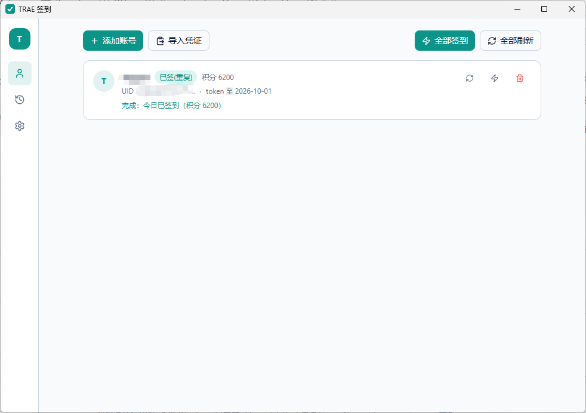
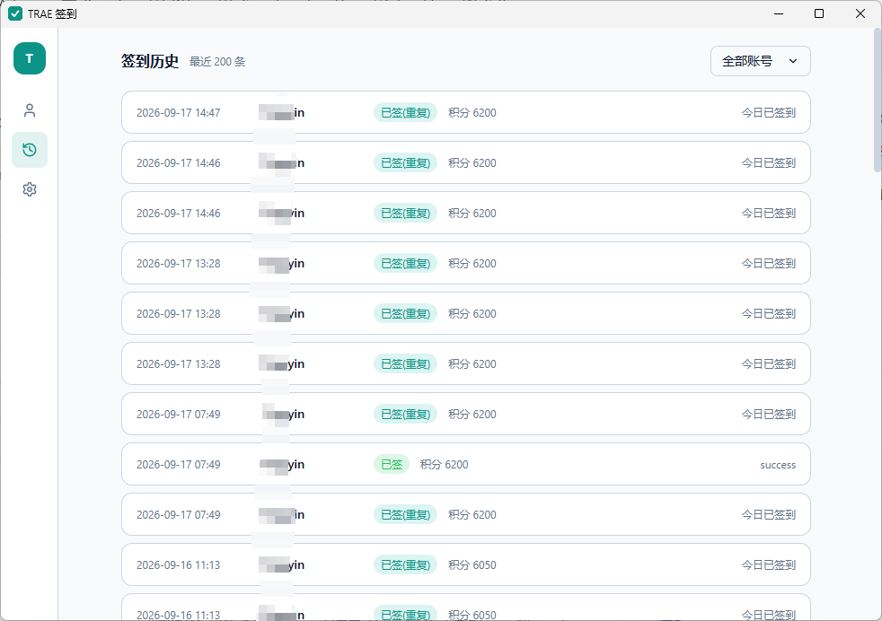
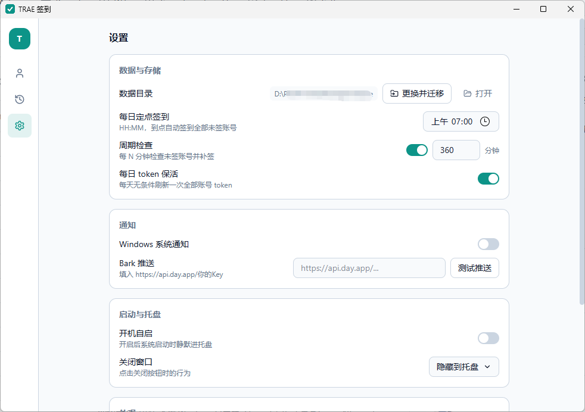

# trae-signin-gui（TRAE 签到）

把 [Maquer/trae-signin](https://github.com/Maquer/trae-signin)（纯 Go CLI：登录 → 签到 → 积分 → Bark）实现为 **Windows 桌面 GUI**。技术栈：Tauri 2 + React 19 + Vite 7 + Tailwind 4 + zustand，业务逻辑全部用 Rust 重写（不保留 Go、不用 sidecar），交付物为**单 exe 便携文件**。

- **下载**：无需自己构建，到 [Releases](../../releases) 页面下载 `trae-signin-gui.exe` 即可直接使用
- 出问题的排查入口：[TROUBLESHOOTING.md](TROUBLESHOOTING.md)
- 设计与已拍板决策：[PLAN.md](PLAN.md)（未修问题见其第 9 节）

---

## 功能

- **账号**：应用内 OAuth 登录（内置 `127.0.0.1:18080-18089` 回调服务自动捕获，无需粘贴链接）+ 粘贴凭证 JSON 导入 + 删除
- **签到**：串行批量 + 逐账号实时进度 + 单账号重签；积分查询展示
- **调度**：启动补签 + 每日定点（默认 08:00 可改）+ 周期检查（默认 30 分钟可关）+ 每日 token 保活
- **托盘**：常驻图标（未签完显示红点）+ 菜单（显示主窗口 / 立即签到全部 / 今日状态 / 退出）
- **通知**：Windows 系统通知（默认开）+ Bark 可选（设置页可测试推送）
- **历史**：JSONL 追加存储，最近 200 条，按账号筛选
- **凭证**：`auths/trae-{uid}.json` 嵌套格式，与 CLI 版、GitHub Actions secrets 互通（兼容扁平历史格式）

---

## 程序截图

### 账号管理 — 批量签到、实时进度、积分展示



### 签到历史 — 最近 200 条，按账号筛选



### 设置 — 定时、通知、托盘与数据目录



---

## 快速上手

1. 双击 `trae-signin-gui.exe`。首次运行 Windows 可能弹 SmartScreen「已保护你的电脑」——点 **更多信息 → 仍要运行**（exe 未签名，属预期）。
   Windows 11 自带 WebView2；老版本 Win10 若缺失，首次启动会弹出微软官方引导安装。
2. 引导卡点 **选择数据目录**（默认预填 exe 同级目录）。程序把这一行路径写进 exe 同级的 `data-dir.txt`，以后每次启动靠它找回数据。
3. 「账号」页点 **添加账号** → 浏览器自动打开授权页 → 授权完成后浏览器显示「登录成功，请返回 TRAE 签到应用」→ 回到程序，账号已在列表里。
4. 点 **全部签到**，卡片上会流式显示进度与结果。

关闭窗口默认只是隐藏到托盘，程序继续在后台按定时器签到。要真正退出：托盘右键 → **退出**。

---

## 日常操作

| 想做什么 | 在哪 |
|---|---|
| 全部签到 / 单个账号重签 | 「账号」页顶部按钮，或账号卡片上的闪电图标 |
| 只刷新状态与积分（不签到） | 「账号」页 **全部刷新**，或卡片的刷新图标 |
| 看历史结果 | 「签到历史」页，或 `history.jsonl` |
| 改签到时刻、开关周期检查 | 「设置 → 定时与保活」 |
| 开 Bark 推送 | 「设置 → 通知」填 `https://api.day.app/你的Key`，可点「测试推送」 |
| 换数据目录 | 「设置 → 数据与存储 → 更换并迁移」（自动迁移 `auths/` 与 `history.jsonl`） |
| 不打开窗口就签到 | 托盘右键 → **立即签到全部** |

**确认积分真的到账**：看账号卡片上的「积分」数字变化，或对比 `history.jsonl` 相邻记录的 `credits`。徽章「已签」= 本次签到成功；「已签(重复)」= 今天早就领过了。

---

## 定时与限流

程序内有四个触发点：启动 15 秒后补签一轮、每日定点（默认 08:00）、周期检查（默认 30 分钟）、每日 token 保活。它们共用一把互斥锁，同一时刻只跑一轮；被锁占用的定时任务会顺延到下一次 tick（30 秒）重试，不会整天丢失。

上游会对签到接口做风控，曾表现为「**当前参与用户太多，请稍后再试**」（code=9074）。这类响应实际意味着**本次积分没领到**。2026-09-16 版已定位根因并对齐官方客户端契约（签到请求体 `{"req_source":2}` + 16 位数字设备号，旧凭证的设备号自动迁移），正常情况下不再出现；若上游真限流，程序会退避重试（20s 起步指数递增，带抖动），仍失败才算今日未签，之后由周期检查继续补。

降低撞上概率最有效的办法是**避开整点**：把每日定点从 `08:00` 改成 `03:30` 或 `11:20` 这类冷门时刻。详见 [TROUBLESHOOTING.md 第 3.1 节](TROUBLESHOOTING.md)。

---

## 迁移与备份

换机或搬家时，这三样不能丢（都在同一个数据目录里）：

| 路径 | 丢了会怎样 |
|---|---|
| `auths\` | 全部凭证丢失，需逐个重新登录 |
| `history.jsonl` | 历史丢失；重启后「今日已签」判断也依赖它恢复 |
| `settings.json` | 定时、通知等设置回默认值 |

exe 同级的 `data-dir.txt` 只是指向数据目录的一行文本。移动 exe 到新位置后，把 `data-dir.txt` 和数据目录一起带走即可；或者在新位置启动后在应用内重选目录，程序会自动迁移。

`auths/trae-{uid}.json` 是嵌套的 `{auth, account}` 结构，可直接被 Go CLI 版和 GitHub Actions secrets 复用。

---

## 开机自启

默认**关闭**，在「设置 → 启动与托盘」开启。开启后系统启动时以 `--hidden` 参数静默进托盘、不弹窗口（2026-09-15 版起生效；更早的 exe 自启时会弹出窗口，功能不受影响）。

---

## 开发

```bash
npm install                          # 前端依赖
npm run tauri dev                    # 开发运行（需 Rust 1.75+ 与 Node 18+）
cargo test -p trae-signin-core       # Rust core 单元测试（53 项）
cargo check --workspace --all-targets
```

## 构建（单 exe 便携文件）

```bash
npm run build                                                   # 前端产物 dist/（tsc -b && vite build）
cargo build --release -p trae-signin-gui --features custom-protocol
# 产出 target/release/trae-signin-gui.exe
```

**注意**：`--features custom-protocol` 必须带上——它把 `dist/` 前端资产嵌入 exe；缺失时 release 运行会去请求 devUrl（localhost:5173）导致「无法访问此页面」。跳过 NSIS/MSI bundle（`tauri.conf.json` 中 `bundle.active: false`），交付物为单 exe。

也可以直接推送 `v*` 格式的 tag（如 `v0.1.1`），[GitHub Actions](.github/workflows/release.yml) 会在 Windows runner 上自动跑测试、构建并把 exe 附加到对应的 Release；日常推送到 main 则由 [CI](.github/workflows/ci.yml) 自动跑前端构建、`cargo test` 与 clippy。

---

## 目录结构

```
├── src/                       # React 前端（账号 / 历史 / 设置三页）
├── src-tauri/                 # Tauri 壳（命令、托盘、调度、登录回调服务）
├── crates/trae-signin-core/   # 纯逻辑 crate（auth / upstream / login / scheduler / history / settings）
├── PLAN.md                    # 规格、已拍板决策、上游 API 事实、遗留问题登记
├── TROUBLESHOOTING.md         # 排障手册（症状 → 诊断 → 处置）
└── scripts/gen-icons.mjs      # 图标生成脚本（node scripts/gen-icons.mjs）
```

---

## 已知限制

- **上游 API 无官方文档**，端点常量集中管理于 `crates/trae-signin-core/src/upstream.rs`，上游变更只需改一处
- **运行日志**：`{数据目录}\app.log`（Info 级，超 2 MiB 轮转）。上游以 HTTP 200 拒绝签到时的**原始响应体只有这里能看到**，`history.jsonl` 只留提取后的文案
- 上游风控曾伪装成拥塞（`code=9074`「当前参与用户太多，请稍后再试」），2026-09-16 版已根治：签到请求体与设备号格式均对齐官方客户端契约（详见 `CODEBUDDY.md` 的 9074 章节）。上游若出新形态风控，`app.log` 的原始响应体是唯一事实来源
- 更新器为骨架占位（设置页「检查更新」按钮），暂未接入发布源
- 登录回调端口 18080-18089 全部被占用时报错中止
- 仅支持 Windows 10/11 x64

完整的未修问题清单（含严重度与修复方向）见 [PLAN.md 第 9 节](PLAN.md)。

---

## 隐私与安全

- 本项目**不上传、不收集任何数据**；凭证、历史、设置全部保存在你本机的数据目录里
- 仓库永远不包含 `auths/`（凭证）、`data/`、`data-dir.txt` 与日志文件（已列入 `.gitignore`），请勿手动提交它们
- 代码中不包含任何硬编码的密钥；Bark Key 等仅保存在你本机的 `settings.json`

---

## 免责声明

本项目为个人学习用途的第三方非官方工具，与 TRAE 官方**无任何关联**。使用本项目产生的账号风控、积分清零、封禁等一切后果由使用者自行承担。请自行评估并遵守目标平台的服务条款。
