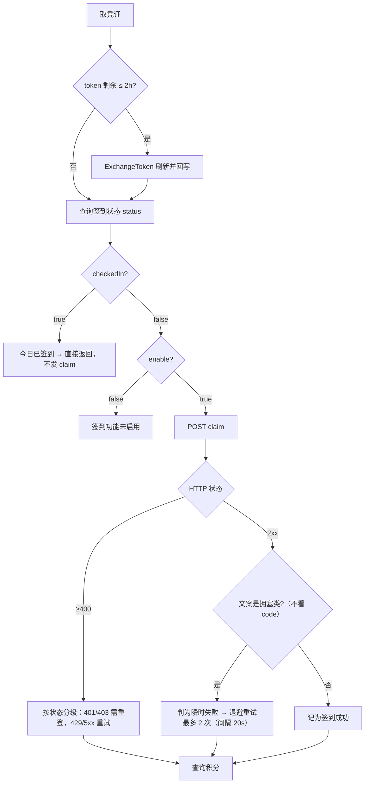

# TRAE 签到 — 排障手册

**适用版本**：0.1.0（2026-09-16 起含日志后端与签到判据收紧；更早构建的 exe 行为不同，见第 4 节）
**读者**：日常使用者。需要改代码才能解决的项目见 [PLAN.md 第 9 节「遗留问题登记」](PLAN.md)。

---

## 0. 先读这条：日志在 `{数据目录}\app.log`

2026-09-16 起装了日志后端：Info 级、超 2 MiB 轮转为 `app.log.1`、跟随数据目录变更。

**最有价值的一行**是 `claim HTTP 200 OK 响应体: {...}` —— 上游拒绝签到时的**原始响应体只有这里能看到**，
`history.jsonl` 里只剩提取后的文案。排查签到问题请两处对照。

> 隐私提醒：`app.log` 与 `auths\` 同目录、同一敏感级别，异常文案里可能带 token 类字段。求助时贴日志前先想想要不要打码。

---

## 1. 四个信息来源

| 来源 | 位置 | 用途 |
|---|---|---|
| 签到历史 | `{数据目录}\history.jsonl` | 每次签到的结论与上游文案，**首要排查入口** |
| 运行日志 | `{数据目录}\app.log` | 上游**原始响应体**、重试与顺延轨迹；`history.jsonl` 看不到的都在这里 |
| 账号卡片 | 应用「账号」页 | 当前状态徽章、积分、token 到期、需重新登录标记 |
| 托盘 | 系统托盘图标 | 「今日状态：已签 N/M」+ 红点，适合不打开窗口时快速确认 |

`{数据目录}` 的值记录在 exe 同级的 `data-dir.txt` 一行文本里。默认就是 exe 所在目录。

### history.jsonl 字段

每行一个 JSON 对象（JSONL）：

| 字段 | 含义 |
|---|---|
| `ts` | 秒级 Unix 时间戳 |
| `uid` / `nickname` | 账号 |
| `status` | `ok` 本次成功 / `already` 今日已签 / `disabled` 功能未启用 / `failed` 失败 / `unknown` 未知 |
| `credits` | 该次查询到的总积分，`null` 表示没查到（不代表 0） |
| `message` | 结论说明；失败时通常是上游原文 |

### 常用命令（PowerShell）

```powershell
# 数据目录在哪
Get-Content "$PSScriptRoot\data-dir.txt"     # 或直接 type D:\Pa\AI-TraeQD\target\release\data-dir.txt

# 最近 5 条
Get-Content 'D:\Pa\AI-TraeQD\target\release\history.jsonl' -Tail 5

# 只看失败记录（逐行解析，兼容 PowerShell 5.1 与 7）
Get-Content 'D:\Pa\AI-TraeQD\target\release\history.jsonl' |
  ForEach-Object { $_ | ConvertFrom-Json } |
  Where-Object status -eq 'failed' |
  Select-Object -Last 10
```

---

## 2. 快速定位：你看到的文案 → 含义 → 处置

| 你看到的文案 | 含义 | 处置 |
|---|---|---|
| `当前参与用户太多，请稍后再试` | **上游真的在拒绝这次签到**，积分没到账。单轮自动重试 2 次（间隔 20s）；整轮无进展时定点轮按 5/15/30/60 分钟阶梯延后再试 | 见 3.1 |
| `今日已签到` | 今天积分早就领过了 | 无需处理。注意：这条路径**不会**触发签到请求，见第 4 节 |
| `签到功能未启用` | 该账号上游就没开签到（新号/受限号） | 换账号或去 TRAE 侧确认资格 |
| `需重新登录` + `刷新 token 失败（需重新登录）` | refreshToken 已失效（401/403） | 删除该账号后重新登录或重新导入凭证 |
| `刷新失败(可重试)` | 网络/超时类刷新失败，**不是**凭证坏了 | 点该账号的刷新按钮重试即可 |
| `签到失败: 可重试错误（网络/超时）: …` | 上游 408/429/5xx 或网络错误，已重试过 | 稍后重签；持续则查网络/代理 |
| `未知` 徽章 | 没拿到状态（多为查询失败） | 点刷新；反复出现看 history.jsonl 的 message |
| `积分 -` / 积分不显示 | 积分查询失败，与签到成败**无关** | 可忽略；签到可能已成功 |
| `签到进行中，请稍后再试` | 另一轮正在跑（互斥） | 等它结束 |
| `回调端口 18080-18089 均被占用，请释放端口后重试` | 登录回调端口全占 | 见 3.4 |
| `登录超时（5 分钟）` | 5 分钟内没等到浏览器授权回调 | 重新点添加账号，授权后留意浏览器是否回到了 `127.0.0.1` 页面 |
| `回调缺少 refreshToken / userJwt.Token，无法登录` | 浏览器授权页没有正常回跳 | 见 3.4 |
| `凭证格式错误: 凭证缺少 accessToken / refreshToken` / `凭证缺少 uid` | 粘贴导入的 JSON 不完整 | 核对是否复制全了 |
| `数据目录未初始化` | 首次启动还没选目录 | 按引导卡第 1 步 |
| `目录不可写` | 选在了只读位置（如 Program Files） | 换到可写目录 |
| `更新源未配置（更新器为骨架占位，暂未接入 GitHub Releases）` | **设计如此，不是故障**：更新检查功能有意留空 | 见 3.8 |

---

## 3. 具体问题

### 3.1 签到提示「当前参与用户太多，请稍后再试」

**这是上游拒绝了这次签到，不是本机配置问题。** 上游回 HTTP 200，但签到**没有生效**。`app.log` 里能看到原始响应体（2026-09-16 实测）：

```json
{"code":9074,"message":"当前参与用户太多，请稍后再试"}
```

只有 `code` 和 `message` 两个字段。程序现在**只要文案是拥塞类就判为瞬时失败**（不再要求 `code != 0`），
退避重试 2 次（间隔 20s）；整轮无进展时定点轮按 5/15/30/60 分钟阶梯延后再试，最后由周期检查兜底。

实测证据（同一个账号的真实记录）：

```
2026/9/15 08:00:06  failed  5750  当前参与用户太多，请稍后再试
2026/9/15 08:01:50  failed  5750  当前参与用户太多，请稍后再试
2026/9/15 08:02:30  already 5900  今日已签到        ← 人工补签后积分才 +150
```

> **但这句话很可能不是字面意思。** 上面那三分钟内，本客户端连吃三次 9074，而你在原程序/网页手动补签**一次就成功**——同账号、同 IP、只隔一分钟。这更像**针对本客户端的风控/限流**，不是全国用户在挤。含义：
> - 拉长间隔、少发几次是对的（已照此把单轮从 3 次降到 2 次），但**再多的重试也未必能突破**；
> - 真要解决，得搞清上游对这个客户端的判定条件（请求头指纹、`X-Device-Id`、调用频率），那是另一件事，已登记在 PLAN 第 9 节。

手动能做的两件事：

1. 「设置 → 每日定点签到」避开整点高峰。08:00 是国内用户密集时段，改成 `03:30` 或 `11:20` 这类偏门时刻。
2. 「设置 → 周期检查」保持开启，它会在限流窗口过去后自动补签。

### 3.2 显示「需重新登录」

只有 refreshToken 被服务端拒绝（401/403）才会这样标记，此时该账号无法自动恢复。

处置：先点该账号的刷新按钮排除一次性网络故障；确认仍在，就删除账号 → 重新登录（或重新粘贴导入凭证）。

> 已知缺陷：旧版本里刷新与签到可能并发轮换同一个 refreshToken，会把健康账号误标成「需重新登录」。2026-09-15 版已修（刷新轮也走互斥锁）。若你在旧 exe 上被误标，重登一次即可。

### 3.3 到点没有自动签到

按顺序检查：

1. 程序是否还活着——托盘图标在不在。关闭主窗口默认只是隐藏到托盘，托盘图标没了才是真退了。
2. 「设置 → 周期检查」是否被关掉了；关掉后只剩每日定点一次机会。
3. 电脑当时是否睡眠/休眠。调度是进程内定时器，睡眠期间的触发点不会补跑，但**醒来看板的下一次 tick（30 秒一次）会补上**——前提是该时刻已过。
4. `history.jsonl` 里那个时刻附近有没有记录。若有一条 `failed`，那是限流不是没触发（见 3.1）。
5. 有没有另一轮正占着互斥锁。现在版本遇锁会顺延，30 秒后的下一次 tick 重试，不再像旧版那样整天丢弃。

### 3.4 登录卡住 / 回调没抓到

登录流程：程序生成链接 → 打开浏览器 → 本地在 `127.0.0.1:18080`（占用则递增到 18089）等一次 `/authorize` 回调 → 换 token → 落盘。

- **端口全被占用**：关掉其他正在监听的程序（重复启动的本程序、其它 IDE 的回调服务），或重启系统后再试。范围固定 18080-18089，不可配置。
- **浏览器没自动打开**：登录链接会写在被丢弃的日志里，当前版本拿不到。可用「导入凭证」路径替代：从别处取到凭证 JSON 后粘贴导入。
- **超时/没反应**：确认授权页真的完成了授权（不是停在确认页）。授权后浏览器应显示「登录成功 — 请返回 TRAE 签到应用」；停在空白页或报错说明回调没送到，检查是否有浏览器插件拦截 `127.0.0.1` 跳转。
- **代理/VPN 干扰**：少数代理会劫持 `127.0.0.1` 的回调请求，临时关掉再登录。

### 3.5 积分数字不对或不动

积分来自 `ide_user_ent_usage`，与签到是**两个独立请求**。查询失败时记为 `null`（界面显示 `-`），不会显示成 0。签到成功但积分没变，先按 3.1 判断上游是否真的收了这次请求。

### 3.6 托盘「今日状态：已签 2/2」但刚加了新账号

分母用的是**今日被程序处理过的账号数**，不是凭证总数。新导入/新登录的账号在被签到或刷新之前不进分母，所以红点可能不亮。手动点一次「全部签到」或刷新即恢复正确。

### 3.7 「更新源未配置」

有意留空的功能，不影响任何签到能力。见 PLAN 决策 #17。

### 3.8 开机自启后弹了窗口

2026-09-15 版已修（窗口改为初始不可见，由程序按 `--hidden` 参数决定是否显示）。若你手上是更早的 exe，自启时窗口会弹出来——重新构建或等下一版即可，功能不受影响。

---

## 4. 如何确认限流修复真的生效了（重要）

签到流程长这样：



**关键点**：只有 `checkedIn == false` 时才会发出 claim 请求。你今天已经领过积分的话，点「全部签到」只会走到上面的 F 分支，显示「今日已签到」——**这条路径完全绕开了被修的地方，不能用来验证修复**。

**验证前必须先确认你跑的是新 exe**（这是本项目最容易踩的坑）：Windows 会锁住运行中的 `trae-signin-gui.exe`，
应用开着时构建**只会刷新 `deps\*.rlib`，exe 还是旧的**，代码修了但行为没变。两条判据任选：

```powershell
Get-Item .\trae-signin-gui.exe | Select-Object LastWriteTime   # 是否晚于你最后一次改代码
Get-Content .\app.log -Tail 5                                  # 2026-09-16 前的旧 exe 不会生成这个文件
```

**2026-09-16 已完成验证**（当天 `checkedIn == false`，是真正能证明问题的时刻）：

```
07:00:12  ok      5900  当前参与用户太多，请稍后再试      ← 旧 exe：假成功
08:23:19  failed  5900  签到失败: 可重试错误（网络/超时）: 上游繁忙（code=9074）…  ← 新 exe：如实记录
```

同一时段 `app.log` 里能看到每轮两次 claim 尝试、间隔 20s，以及定点轮的延后日志。
**判据本身已确认生效**；至于积分能不能真到账，取决于上游何时放行该客户端（见 3.1 的风控假设）。

将来仍要验证时的有效方式（任选其一）：

- 等下一次 `checkedIn == false` 的时刻（通常次日定点轮），看 `history.jsonl` 是否不再出现裸的「当前参与用户太多」而是 `ok`，或出现 `上游繁忙（code=…）` 且随后重试成功。
- 用一个当天还没领积分的账号签到。
- 观察积分：一次真实成功的签到会让 `credits` 增加。

---

## 5. 换机 / 重装时不能丢的三个路径

| 路径 | 丢了会怎样 |
|---|---|
| `{数据目录}\auths\` | 全部凭证丢失，需要逐个重新登录 |
| `{数据目录}\history.jsonl` | 历史丢失；重启后「今日已签」判断也依赖它恢复 |
| `{数据目录}\settings.json` | 定时、通知、 Bark 等设置回默认值 |

exe 同级的 `data-dir.txt` 只是指向数据目录的一行路径。移动 exe 时把它和数据目录一起带走，或者在新位置启动后重选目录（程序会自动迁移 `auths/` 与 `history.jsonl`）。

`auths/trae-{uid}.json` 采用嵌套 `{auth, account}` 格式，与 Go CLI 版和 GitHub Actions secrets 互通，可直接复用。

---

## 6. 求助时请附上

1. 出问题账号的 `history.jsonl` 最近若干行（**注意：里面不含 token，可以放心贴**；但同目录的 `auths/*.json` 含真实凭证，绝不要外发）。
2. `app.log` 对应时段的行——上游**原始响应体只在这里**（`claim HTTP …  响应体: {…}`）。⚠️ 与 history.jsonl 不同：异常文案里可能带 token 类字段，贴之前先自己看一遍、必要时打码。
3. exe 的构建时间（右键 exe → 属性 → 详细信息）。签到判据在 2026-09-15 有过一次重要修正，旧版行为不同。
4. 你看到的界面文案原文。
5. 「设置」页各开关的当前状态（定点时刻、周期检查、保活）。
